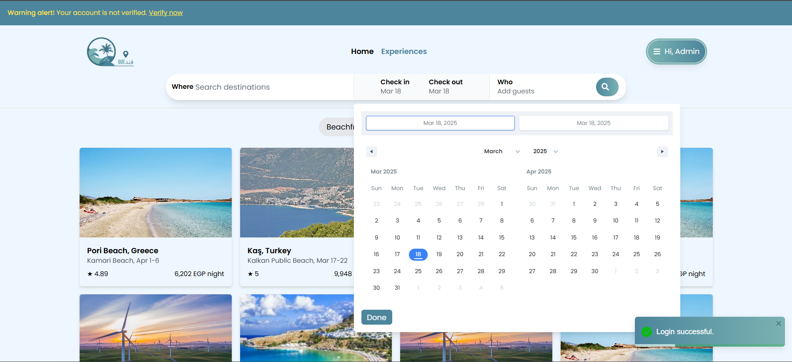
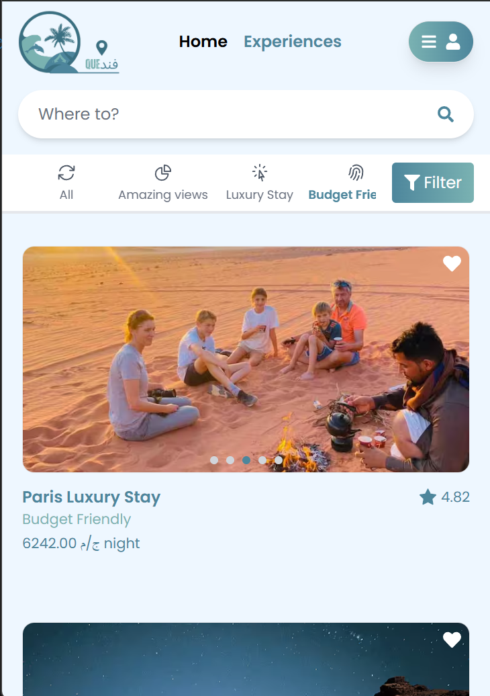
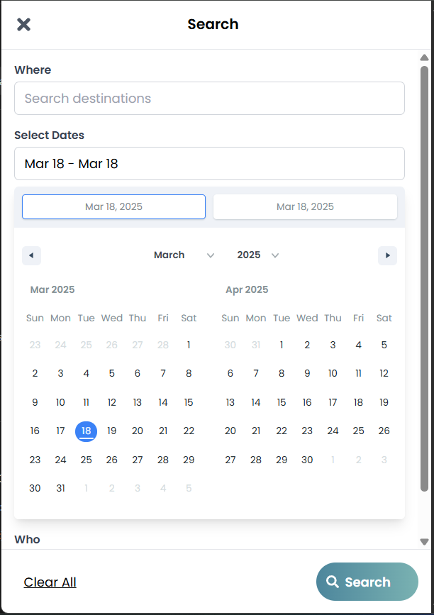
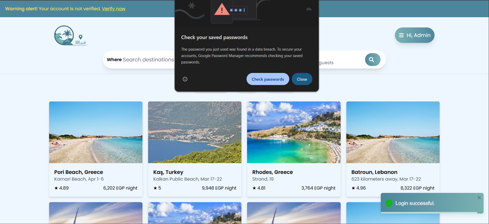
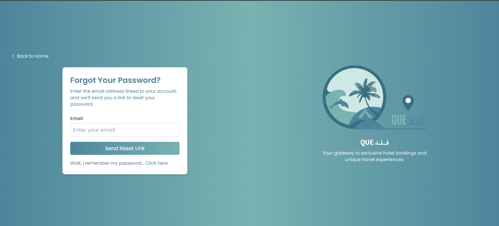
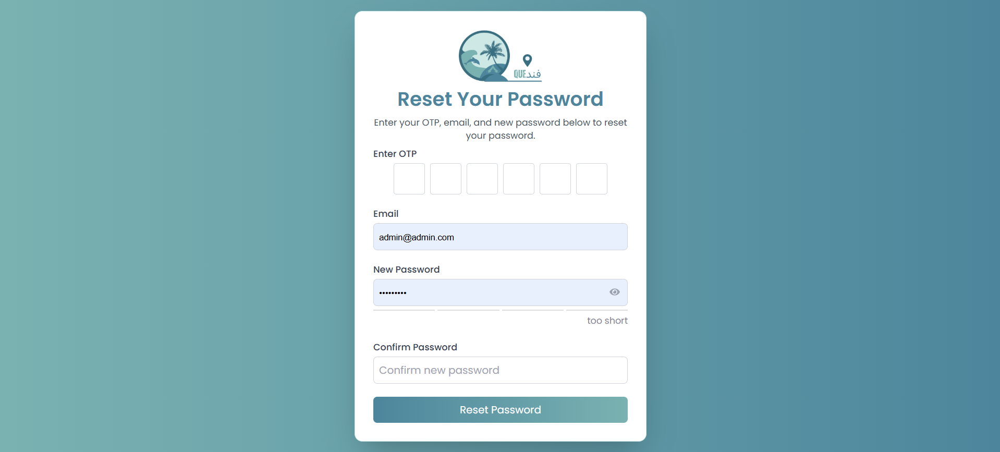
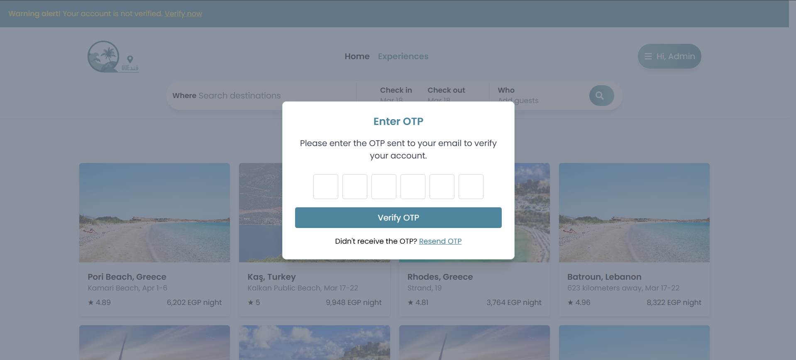

# Fandoky - Accommodation Booking Platform

Fandoky is a platform that allows users to book accommodations. It's built with React.js for the frontend and Laravel (for testing) / Django (planned) for the backend.

## Features

* User authentication (login, signup, logout)
* Password reset
* Email verification
* User data management using Context API
* Updated landing page
* Updated login view and functionality
* OTP verification and resend
* Password strength check

## Technologies Used

* Frontend: React.js, Tailwind CSS, React Router DOM, React Toastify, React-icons, jwt-decode, React Date Range, React Password Strength Bar, zxcvbn

## Getting Started

1. Clone the repository: `git clone https://github.com/abdelrhmanMohmaed/Fandoky`
2. Install dependencies: `yarn install` or `npm install`
3. Start the development server: `yarn dev` or `npm start`
4. Open your browser at `http://localhost:5173/`

## Contributing

1. Fork the repository
2. Create a new branch: `git checkout -b my-new-feature`
3. Make your changes
4. Commit your changes: `git commit -am 'Add some feature'`
5. Push to the branch: `git push origin my-new-feature`
6. Create a new pull request

## Screenshots

**Note:** The login functionality uses an external API that is currently configured to work only on my local machine. To test the login feature, you will need to set up your own API or modify the existing one to work on your machine.