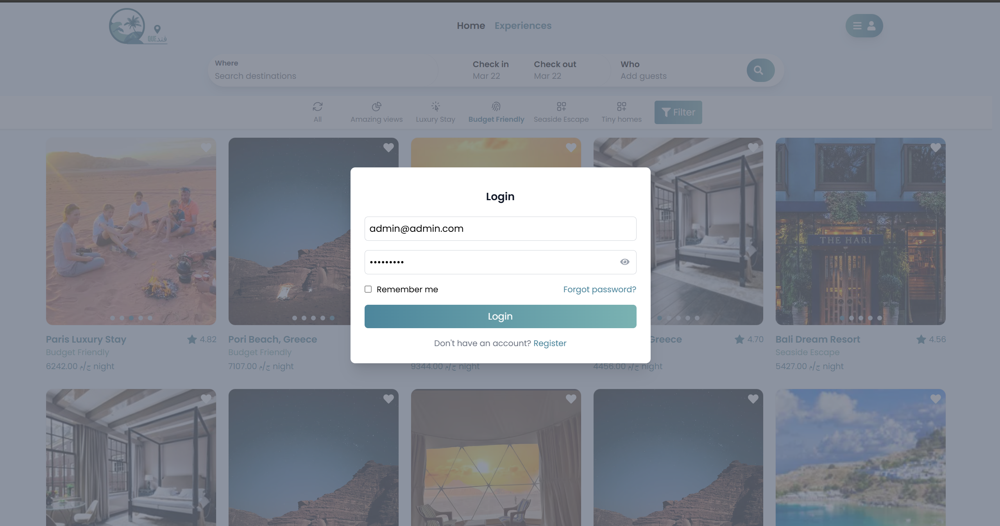
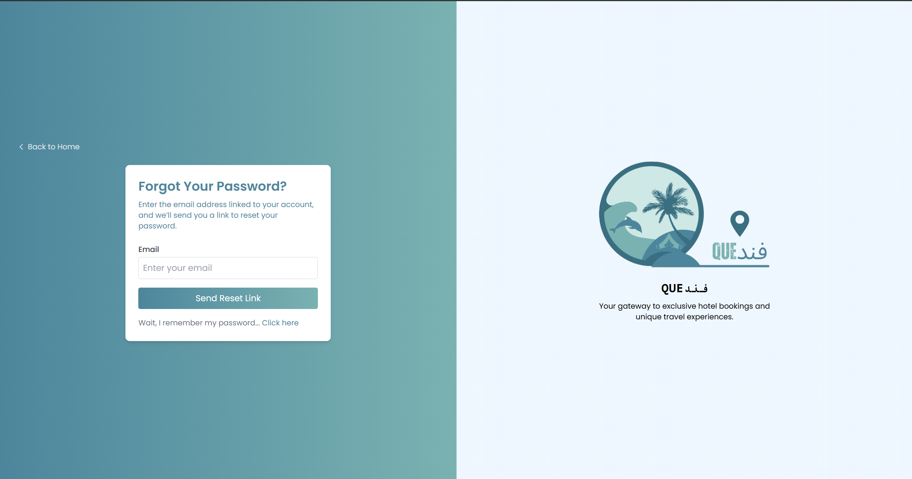

# Fandoky - Accommodation Booking Platform

Fandoky is a platform that allows users to book accommodations. It's built with React.js for the frontend and Laravel (for testing) / Django (planned) for the backend.

## Features

* User authentication (login, signup, logout)
* Password reset
* Email verification
* User data management using Context API
* Updated landing page
* Updated login view and functionality
* OTP verification and resend
* Password strength check
* **Global Axios Helper:** Added a helper file to manage Axios requests globally.
* **Context for Places Data:** Implemented Context API to manage and fetch place data.
    * **Display Places:** Context is used to fetch and display all places on the Home page.
    * **Filter Places:** Implemented filtering functionality in the Navbar using Context data.
    * **Loading Card:** Added a loading card component for better user experience during data fetching.
* **Footer:** Added a footer component.
* **Contact Info Page:** Added a new page to display contact information.
* **Infinite Scroll for Data Fetching:** Implemented infinite scroll functionality on the Home page to fetch and display more data as the user scrolls down.
* **Search Modal on Landing Page:** Added a search modal component to the landing page for improved search functionality.
* **Icon Component:** Created a reusable component for icons to simplify icon usage throughout the application.
* **Geolocation and Nearby Places:** Implemented geolocation functionality using Google Maps API to find and display nearby places.
    * **User Location Context:** Created a context to share the user's current location.
    * **Place Search Page:** Added a page to display search results for places.
    * **Place Details Page:** Added a page to display details for a specific place.
    * **Booking Modal:** Added a booking modal to the Place Details page.

## Technologies Used

* Frontend: React.js, Tailwind CSS, React Router DOM, React Toastify, React-icons, jwt-decode, React Date Range, React Password Strength Bar, zxcvbn, @react-google-maps/api

## Getting Started

1. Clone the repository: `git clone https://github.com/abdelrhmanMohmaed/Fandoky`
2. Install dependencies: `yarn install` or `npm install`
3. Create a `.env` file with your Google Maps API key (if using geolocation features).
4. Start the development server: `yarn dev` or `npm start`
5. Open your browser at `http://localhost:5173/`

## Contributing

1. Fork the repository
2. Create a new branch: `git checkout -b my-new-feature`
3. Make your changes
4. Commit your changes: `git commit -am 'Add some feature'`
5. Push to the branch: `git push origin my-new-feature`
6. Create a new pull request

## Screenshots

**Note:** All API functionalities, including login and geolocation features, are currently configured to work only on the local machine. To fully test these features, you will need to set up your own API endpoints and obtain a Google Maps API key.